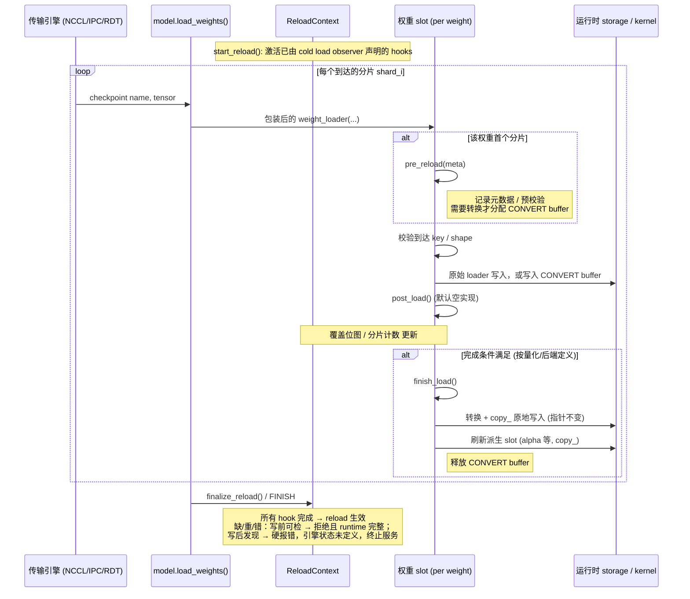
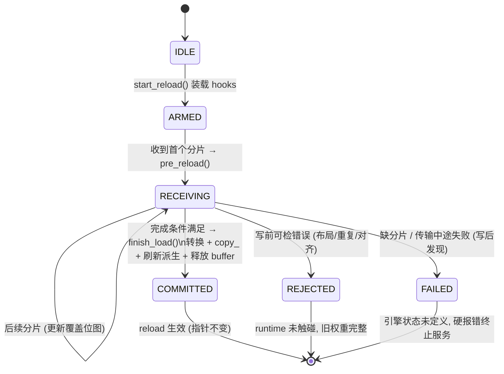

# Weight Reload 抽象设计

状态：设计提案（仅文档，不含代码改动）。

适用范围：`vllm/model_executor/model_loader/reload/` 下的运行时权重热更新路径，
以及量化方法（FP8 dense / CUTLASS FP8 MoE 等）与 reload 流程的交互面。

## 1. 设计目标（硬约束）

按优先级排序，任何抽象层的取舍都必须服从以下四条：

1. **权重完整加载**：一次 reload 只有在"计划内每一个目标张量都被完整、
   恰好一次地写入"之后才允许生效。任何缺失分片、重复分片、形状/精度不匹配
   都必须在写入运行时存储之前被拒绝，而不是以部分写入的状态暴露给推理。
2. **运行时权重指针不偏移（CUDA graph 稳定性）**：reload 后所有被 CUDA
   graph 捕获的权重地址必须逐字节不变。即：
   - 不替换 `Parameter` 对象、不重新分配底层 storage、不新建 kernel 对象；
   - 所有写入都是 `copy_` 到既有 storage；
   - 只有 cold load（首次加载）允许安装 Parameter 与 kernel。
3. **尽量少用暂存 buffer，能原地拷贝就原地拷贝**：当源张量的 layout/dtype
   与运行时存储一致时，直接写进运行时 storage（零暂存）。只有当源需要
   转换（requant、block scale 重排、expert 融合）时才分配转换 buffer，且
   buffer 的生命周期以"一次原子提交"为界，转换完即释放。
4. **不使用 layerwise reload**：不走逐层流式（边下边转边写层）的方案。
   reload 以"一次完整的权重集合"为单位：全部源张量就位并通过完整性校验后，
   一次性提交。layerwise 流式写入在提交中间态上无法保证目标 1，且为省
   显存引入的复杂度与该目标冲突；显存压力通过目标 3 的原地写解决，
   而不是通过把提交拆成逐层。

## 2. 核心抽象

### 2.1 一次 reload 的五个阶段

```
DECLARE -> SOURCE -> VALIDATE -> COMMIT -> FINISH
```

| 阶段 | 职责 | 允许的分配 |
| --- | --- | --- |
| DECLARE | 量化方法/后端声明本次 reload 需要哪些张量（checkpoint 名字、期望 shape/dtype、loader 元数据），并给出运行时落点（runtime slot 到 storage 的映射） | 无（仅元数据） |
| SOURCE | 接收源张量（NCCL/IPC/RDT 等传输引擎喂入），按落点分类：可直接原地写的进入 in-place 队列；需要转换的进入转换队列 | 仅转换 buffer，大小以"单个原子提交单元"为上界 |
| VALIDATE | 完整性校验：计划集合全覆盖、无重复写、无越界写（expert/row/column 覆盖位图）、dtype/shape 匹配 | 无 |
| COMMIT | 一次性把校验通过的数据写入运行时 storage：in-place 队列直接 `copy_`，转换队列转换后立即 `copy_` 并释放 buffer | 转换期间的临时 buffer |
| FINISH | 刷新派生量（alpha、reciprocal scale 等 kernel/config 持有的引用），本次 reload 生效 | 无 |

关键性质：

- **写前可检的错误**（元数据/shape/dtype/偏移/对齐/重复到达）在任何写入
  之前拒绝，此时 runtime 未被触碰，旧权重完整；
- **写后才能判定的错误**（缺分片只能在 FINISH 判定、传输中途失败）发生时，
  原地写已经把部分新值写进了 runtime storage，而我们不保存旧权重——
  此时**引擎状态未定义**：必须硬报错并终止服务（重启或重新 cold load），
  不允许带病继续推理；
- 没有 staged 数据的 FINISH 是 no-op，保证重复触发安全。

### 2.2 Runtime Slot：指针稳定性的载体

每个可被 reload 的运行时张量由一个 **runtime slot** 表示：

- slot 持有 reload 开始时就存在的 storage（cold load 时创建）；
- COMMIT 只对该 storage 做 `copy_`，slot 的 data_ptr、Parameter 对象、
  kernel 内的引用在任意次 reload 后保持不变；
- CUDA graph 捕获的是 slot 的地址，因此 graph 无需重建、无需重新捕获。

这条不变量需要量化方法侧配合：kernel 持有的所有派生张量（如 per-tensor
alpha、activation scale reciprocal）也必须是 slot，由 FINISH 用 `copy_`
刷新，而不是重新赋值属性。

### 2.3 Storage Policy：原地写优先

对每个计划内张量，DECLARE 阶段决定其存储策略（现有
`ReloadStorageMode` 的语义扩展）：

- **IN_PLACE（原地拷贝）**：源 layout/dtype 与运行时一致（例如 dense
  per-tensor FP8 权重、无需重排的 scale）。源到达即 `copy_` 进 runtime
  storage，零额外显存。
- **CONVERT（一次性转换 buffer）**：源需要转换（requant、block scale
  行列交换、gate/up 交换与 padding、expert 融合）。分配与运行时同构的
  转换 buffer，校验后在 COMMIT 内完成转换并写回。

选择规则：能 IN_PLACE 的一律 IN_PLACE；CONVERT buffer 按张量逐个分配、
写回后立即释放，峰值显存 = max(单个张量转换 buffer)，而不是整个模型的
staging 副本。

### 2.4 完整性校验（不写不完整权重）

校验分两类，拒绝语义不同：

1. **写前校验（拒绝后 runtime 完整）**：源 shape/dtype 与 cold load 时
   记录的元数据一致；目标区间越界、block 对齐不满足、别名冲突、同一
   槽位重复到达——都在写入前拒绝。
2. **完成性校验（拒绝时引擎状态未定义）**：DECLARE 声明的每个张量、
   每个分片（expert id、行/列区间、shard_id）恰好写入一次，由覆盖
   位图/到达表在 FINISH 时判定。缺失只能在写流结束后发现，此时原地
   写已发生、无旧权重备份，因此缺失/中途失败一律硬报错，引擎必须
   停止服务（重启或 cold load 恢复），不做静默降级。

不提供部分提交，也不提供跨张量事务回滚：写前校验消除可预防的错误，
写后失败靠硬报错保证错误不扩散到推理输出。GPU 拷贝故障属于进程级
异常，不在本抽象的事务语义内。

## 3. 与现有实现的对应关系

- `ReloadStorageMode.STAGING / ALIAS_RUNTIME` 演化为 CONVERT / IN_PLACE
  语义；`StaticReloadStoragePolicy` 的 allow-list 思路保留，但判定依据从
  "名字白名单"变为"源与运行时 layout 是否一致"。
- CUTLASS FP8 MoE 的 DECLARE/转换/FINISH 三段式（`_prepare_moe_runtime`
  / `_convert_moe_runtime` / `_install_moe_kernel` 与 reload 时的 FINISH
  刷新）是本设计在"需要转换的后端"上的实例：runtime shell 在 cold load
  时建好，reload 只重填内容。
- FP8 dense per-tensor reload 是 IN_PLACE 路径的实例。
- `LayerReloadingInfo` 中 layerwise 的 load_numel/loaded_weights 缓冲机制
  不再作为 reload 主路径；完整性校验改由 DECLARE 计划集合 + 覆盖记录
  承担，按张量/分片粒度而非层粒度。

## 4. 非目标与明确排除

- **不做 layerwise 流式提交**（目标 4）：不引入"逐层就绪逐层写"的状态机。
- **不在 reload 路径重建 CUDA graph、重建 kernel、重新分配 storage**。
- **不实现跨张量事务回滚**：用前置校验消除部分写入的来源，而不是事后回滚。
- EPLB、FNUZ、其他 MoE 后端维持现状（fallback），不在本抽象首版范围。
- 传输引擎（NCCL/IPC/sharded RDT）的协议不变；本抽象只约束张量到达后的
  落点、校验与提交。

## 5. 验收标准

1. 写前可检错误（形状/重复/对齐/别名）-> 写入前报错，运行时权重与
   报错前逐字节一致；写后才发现的错误（缺分片/传输中途失败）-> 硬报错，
   引擎状态未定义，必须停止服务，测试断言不再接受新请求。
2. 连续 N 次 reload 后：所有 runtime slot 的 `data_ptr`、Parameter 对象
   id、kernel 内派生张量指针与首次 cold load 后完全一致；CUDA graph
   可直接 replay，输出与等价 cold load 逐 bit 相同。
3. reload 峰值显存增量 <= max(单个 CONVERT 张量 buffer)；全 IN_PLACE
   的模型 reload 显存增量为 0。
4. 空 reload（无新数据）调用 FINISH 是无副作用 no-op。

## 6. Hook 模型：每个权重绑定 pre_reload / post_load / finish_load

### 6.1 概念

- 每个可被 reload 的权重（runtime slot）绑定两个 hook：
  - `pre_reload`：该权重的**第一个分片到达时**调用一次。职责由量化方法/
    后端自定义：记录 cold-load 元数据、分配 CONVERT buffer（仅当需要
    转换时）、做落点与布局的预校验。
  - `post_load`：**每个分片写入后**调用一次，默认空实现。逐分片的写入与
    登记已经在 load_weight 中完成，此钩子仅为量化后端预留增量处理扩展点；
    当前设计把所有修正推迟到完成时，不为省延迟做逐分片转换。
  - `finish_load`：**满足完成条件后**调用一次。完成条件按量化方式与
    后端不同而不同（dense per-tensor：全部分片到齐；CUTLASS block-wise
    MoE：全部 expert/row/column 覆盖位图填满）。职责：执行转换并把结果
    `copy_` 进 runtime storage、scale clamp / backend repack、刷新派生
    slot（alpha、reciprocal scale）、释放 CONVERT buffer、完成性校验。
    凡是依赖"权重完整"的操作一律放这里，不允许放进 post_load 逐分片执行。
- `start_reload` 在任何分片到达之前调用：依据 cold load 观察到的 loader
  调用，构建每个 runtime slot 的到达表并装载 hook；此时尚未有任何数据写入
  runtime storage。
- IN_PLACE 权重的 `pre_reload` 只做校验（零分配），`finish_load` 退化为
  直接 `copy_`——"原地拷贝优先"通过 hook 实现自然落地。

### 6.2 时序图



### 6.3 单权重状态机



### 6.4 不同后端的完成条件与 hook 行为

| 后端 | 完成条件 (触发 finish_load) | pre_reload | finish_load |
| --- | --- | --- | --- |
| FP8 dense per-tensor | 该张量全部分片到齐 | 仅校验 shape/dtype，零分配 | 直接 `copy_` 进 runtime storage (IN_PLACE) |
| CUTLASS FP8 MoE (per-tensor scale) | 全部本地 expert 的 w13/w2 + scale 覆盖位图填满 | 校验 expert 元数据，分配 CONVERT buffer | requant + gate/up 交换 + padding 后 `copy_`，刷新 alpha/reciprocal |
| CUTLASS FP8 MoE (block-wise scale) | 权重 + scale_inv 的 expert/row/column 位图填满 | 同上 | block 行列交换 + clamp 后 `copy_`，刷新派生 slot |

渲染图：[reload-seq.png](reload-seq.png)（时序图）、[reload-state.png](reload-state.png)（状态机）。

## 7. 非量化权重的 observer + LoaderWeightHook 设计

非量化 = 运行时 storage 与 checkpoint 同 dtype、同 layout（或仅相差融合/切分
结构），因此**所有非量化权重都不需要 CONVERT buffer，全部原地写**。
每个被 cold load 观察到的运行时参数注册一个 `LoaderWeightHook`。它只负责
记录到达表、写前校验和完成性校验；运行时偏移、TP/EP 切分、padding 与实际
`copy_` 仍由模型既有的 `weight_loader` 处理。dtype 不一致的 cast（如 fp32 →
bf16）不视为转换：原始 loader 的 `copy_` 隐式完成，零分配。

### 7.1 情况分类

| # | 情况 | 例子 | cold-load 记录的 key | reload 写入 | 完成条件 |
| --- | --- | --- | --- | --- | --- |
| 1 | 普通密集权重，无融合无切分 | RMSNorm weight、o_proj | `full` | 原始 loader 全量 `copy_` | 单分片到达 |
| 2 | 行/列融合权重 | merged QKV、dense MLP gate_up | `shard_id` / `loaded_shard_id` | 原始 loader 按自身映射写对应区间 | 全部逻辑分片到齐 |
| 3 | 词表并行 + padding | embedding、lm_head | `full` | 原始 loader 只写真实词表行 | 单分片到达 |
| 4 | 共享存储 | tie_word_embeddings | 运行时参数名 + 观察到的 key | 原始 loader；同一 slot 的别名到达去重 | 去重后的唯一 slot 写满 |
| 5 | MoE 融合专家权重 w2 | `experts.w2_weight` | `(None, expert_id)` | 原始 MoE loader 写入本地 expert 平面 | 所有本地 expert 到齐 |
| 6 | MoE 融合专家权重 w13 | `experts.w13_weight` | `("w1"/"w3", expert_id)` | 原始 MoE loader 写入对应 expert 半区 | 所有本地 expert 的 w1、w3 到齐 |
| 7 | MoE 共享专家 / 稠密旁路 | DeepSeek shared_experts | 同 #1 / #2 | 同 #1 / #2 | 同 #1 / #2 |
| 8 | dtype 不一致的非量化 | checkpoint fp32 → runtime bf16 | 与对应结构相同 | 原始 loader 的 `copy_` 隐式 cast | 对应分片到齐 |

### 7.2 关键设计点

**到达追踪（ArrivalTracker）。** cold load observer 从每一次原始
`weight_loader` 调用中记录 `(key, shape)`；`initialize_reload` 将这些记录
装入对应 `LoaderWeightHook` 的到达表：

- 普通权重：1 个槽位；
- 融合 dense 权重：按 shard_id 建槽（q/k/v 或 gate/up）；
- MoE w2：按 expert_id 建 E 个槽位；
- MoE w13：按 (expert_id, half) 建 E×2 个槽位，w1/w3 分片独立登记——
  这正面回答了"w13 需要同时记录 w1 和 w3 到达情况"的需求；
- 每个槽位记录：期望 shape、是否已写。

finish_load 的完成条件统一为"到达表填满"，不同情况只是表的形状不同。
重复到达同一槽位、未知 `(shard_id, expert_id)` 或 shape 不匹配都在写入前
拒绝；原始 loader 继续负责自身的偏移/边界校验。

**写入映射。** 非量化 reload 不复制融合、词表 padding、TP/EP 切分或 MoE
expert 到运行时偏移的逻辑。它复用模型 cold load 已验证的原始
`weight_loader`，避免用参数名或张量形状重新推断模型特定布局。

**中间态可见性（必须明确的假设）。** 非量化权重原地写意味着：全部槽位
填满之前，运行时 storage 处于新旧混合状态。这只有在 **reload 期间推理
静默（START 到 FINISH 之间无 batch 执行）** 的前提下才安全——这也是
完整性语义对非量化路径的实际形态：物理上逐分片写，逻辑上 FINISH 才生效；
FINISH 判出缺失时不存在旧权重可回退，引擎状态未定义，只能硬报错。若未来要求 reload 与推理并发，非量化路径需要退回
staging + FINISH 时一次性 copy_，本设计在 hook 层不排除该策略，但默认
不启用（目标 3：能原地就原地）。

**重复与幂等。** 空到达（无分片）时 finish_load 不触发、FINISH 为 no-op；
同一 reload 内 finish_load 只执行一次，重复 FINISH 安全。

## 8. 离线量化 FP8 per-block 的 hook 设计

量化先按两个维度分类：**在线/离线**（源是已量化权重还是高精度权重），
**per-tensor / per-block / per-channel**（per-channel 视为 per-block 在
某一维上 block=1 的特例）。本节只覆盖**离线 FP8 per-block**：源张量本身
就是 FP8 + block scale，dtype 与运行时一致，差异只在后端 layout。

两条设计修正贯穿全表：其一，默认**写入时映射**（pre_reload 只恢复
layout 映射，load 按映射 copy_ 到 runtime 偏移），物理逆变换降级为
非视图 layout 的后备；其二，clamp 等逐元素修正不进 load，推迟到
finish_load 对整张小 scale 张量一次完成。

### 8.1 hook 分工总表

| # | 情况 | 例子 | pre_reload | load_weight | finish_load | 完成条件 |
| --- | --- | --- | --- | --- | --- | --- |
| 1 | 非 MoE 权重本体 | 任意线性层 FP8 weight | 恢复 layout 映射（通常恒等），校验分片元数据 | 按映射 `copy_` 到 runtime 偏移，登记到达 | 空实现 | 权重分片到齐 |
| 2 | 非 MoE block scale | weight_scale_inv | 恢复 block 行列交换映射 + padding 边界，校验分片元数据 | 按映射 `copy_`（行列交换作用于此），padding 区裁剪，登记到达 | refresh_derived_state：scale clamp、backend repack（若有）、派生 slot 刷新 | scale 分片到齐 |
| 3 | MoE 融合权重 w13 | `experts.w13_weight` (E×2N×K) | 建 E×2 到达表（expert × w1/w3 半区），记录半区行偏移 `2N·e` / `2N·e+N` | 按 (expert_id, half) 写入对应行区间（恒等映射），登记槽位 | 空实现 | E×2 槽位填满 |
| 4 | MoE 融合权重 w2 | `experts.w2_weight` (E×K×N) | 建 E 槽到达表，记录 expert 行偏移 `K·e` | 按 expert_id 写入 `[K·e, K·e+K)`（恒等映射），登记槽位 | 空实现 | E 槽位填满 |
| 5 | MoE w13 block scale | `w13_weight_scale_inv` (E×2⌈N/Bn⌉×⌈K/Bk⌉) | 建 E×2 到达表，恢复 gate/up 半区 + block 行列交换映射 | 按 (expert_id, half) 写入对应半区（行列交换作用于此），登记槽位 | 两半区 scale clamp + 派生 slot 刷新 | E×2 槽位填满 |
| 6 | MoE w2 block scale | `w2_weight_scale_inv` (E×⌈K/Bn⌉×⌈N/Bk⌉) | 建 E 槽到达表，恢复 block 行列交换映射 | 按 expert_id 写入（行列交换作用于此），登记槽位 | scale clamp + 派生 slot 刷新 | E 槽位填满 |
| 7 | 融合 QKV × per-block | merged QKV weight + 各自 scale | 按 shard_id 建槽（q/k/v 各一槽，scale 同）；**校验 q、k 行数是 block 尺寸（128）的倍数**，不满足即拒绝 | 按 shard_id 行区间写入，scale 块随之拼接 | 同 #2 | q/k/v 及各自 scale 全部到齐 |
| 8 | 行并行权重 | o_proj、w2 列切分片 | 校验 block 列块边界与 TP 切分边界对齐，不满足即拒绝 | 按列区间写入，对应列块 scale 写入 | 同 #2 | 列分片到齐 |
| 9 | 非视图 layout（后备路径） | 真正交织/打包的后端格式 | 全部校验前移到逆变换之前，然后物理逆变换 runtime storage | 直接 `copy_`（此时 storage 已是 checkpoint layout） | 正变换回 runtime layout + refresh_derived_state | 分片到齐且正变换完成 |

### 8.2 连带问题（范围外，记录）

| 事项 | 说明 |
| --- | --- |
| per-tensor × 融合 QKV | 融合张量若要求单一 scale，q/k/v 各自 scale 不同须取 max 并 requant——属于转换、需要 CONVERT buffer，不是纯 copy_ 路径。per-block 块间独立，无此问题 |

### 8.3 失败语义

| 路径 | 拒绝点 | 失败后 runtime 状态 | 引擎层要求 |
| --- | --- | --- | --- |
| 写入时映射（默认，#1–#8） | pre_reload 元数据/对齐校验失败：runtime 未被触碰，旧权重完整 | 缺分片/重复/中途失败：到达表不满时已发生部分原地写，无旧权重可回退，引擎状态未定义 | 硬报错并终止服务（重启或 cold load），不允许带病继续推理 |
| 物理逆变换（后备，#9） | 全部校验前移到逆变换之前 | 逆变换一旦发生旧 layout 即不存在，任何后续失败不可恢复 | 逆变换到正变换之间视为原子临界区（推理静默的强形式） |
| 公共语义 | FINISH：到达表填满 → finish_load → 生效 | 空到达 → no-op；缺/重/错一律硬报错 | 不变 |

## 9. 基于模块 Tracer 的 reload 状态追踪方案

### 9.1 设计动机

当前 observer + `LoaderWeightHook` 的方案，是从 cold-load 期间实际发生的
`weight_loader` 调用中反向推断 reload 所需的 expected slots。这个方案可以
复用现有 loader 的映射逻辑，但 expected slots 隐藏在 loader 的调用路径中：
不同模块需要通过参数名、`loaded_shard_id`、expert mapping 以及张量 shape
共同推断状态。随着 MoE、量化后端和具有派生权重的复合模块增多，状态定义、
布局映射和 finish 依赖会逐渐分散到 hook、loader 和模块特例中。

Tracer 方案把“应该收到什么”和“已经收到什么”提升为模块级的显式状态对象：

- reload 初始化时，根据模型结构和模块配置构建 tracer；
- 每个权重到达时，向对应 tracer 上报一个规范化的 arrival event；
- tracer 校验 expected slot、shape、重复到达和未知分片，并记录状态；
- finish 阶段从叶子 tracer 向上汇总完成性，执行依赖模块的派生变换；
- 调用端可以获得带有层级、参数、expert 和 shard 信息的 missing 列表。

这里的目标不是重新实现一套 weight loader，而是让 loader 继续负责实际写入
和模型特有的映射，Tracer 负责可验证的 reload 状态机。

### 9.2 Tracer 的职责边界

一个 Tracer 应负责以下状态和检查：

1. **声明 expected slots**：描述该模块在当前 rank、当前并行配置下必须收到
   的参数或分片。
2. **记录 arrival**：记录某个 slot 是否已经收到，以及对应的 shape、dtype、
   来源和必要的元数据。
3. **写前校验**：拒绝未知 slot、重复 slot、shape 不匹配、非法 shard 或
   expert 标识。
4. **判断完成**：只有所有 required slots 到达后，叶子 tracer 才能完成。
5. **汇总 missing**：返回稳定且可定位的缺失路径，而不是只返回一个参数名。
6. **触发依赖节点**：当子 tracer 完成时通知依赖它的父 tracer。
7. **执行 finish**：在输入和依赖完整后，执行派生权重转换并确认输出状态。

Tracer 不应负责以下逻辑：

- 不复制 `weight_loader` 中已有的 TP、EP、offset、padding、fused shard
  和 expert physical mapping 写入逻辑；
- 不通过参数名和 shape 自己猜测模型布局；
- 不持有完整权重或 staging buffer；
- 不替换 `Parameter`、storage 或量化 kernel 所引用的对象；
- 不把“调用了 loader”直接等价为“写入成功”，arrival 应在实际写入成功后
  登记，或由 loader adapter 明确划分 `before_write` 和 `after_write`。

这样可以把状态正确性和物理写入解耦：loader 仍是 layout 的唯一生产者，
Tracer 是 reload 完整性和依赖关系的唯一生产抽象。

### 9.3 Tracer 的归属和对象模型

推荐每个 `nn.Module` 实例拥有一个 owner tracer，而不是让所有同类
`QuantizeMethod` 实例共享一个全局 tracer。原因是 expected slots 取决于
具体模块实例、当前 rank、并行配置和 expert mapping；共享 tracer 容易把
不同层或不同参数的状态混在一起。

Tracer 本身不应继承 `nn.Module`，也不应作为 `nn.Module` 的 registered
submodule 或 parameter 保存。否则它可能被 `named_modules()`、`state_dict()`、
`.to()`、序列化和模块遍历当作模型对象处理。更合适的归属方式是模块持有一个
私有的非注册属性，例如 `_reload_tracer`，或者由 reload context 维护
`module -> tracer` 的外部映射。

Tracer 只保存小型元数据：

- owner module 或稳定的 module path；
- slot 定义和到达位图；
- shape/dtype/layout 的摘要；
- child tracer 和 dependency edge；
- finish 状态、错误状态和 missing 信息。

大权重、转换结果和临时 buffer 仍由模块、quant method 或现有 hook 管理。

### 9.4 Tracer 树和依赖 DAG

模块层级天然可以构成一棵 tracer tree：父模块对应的 tracer 持有成员模块
的 child tracer，并能按模块路径汇总状态。但是派生权重通常依赖多个输入，
因此完整关系不是单纯的树，而是“ownership tree + dependency DAG”：

- **ownership tree** 表示 tracer 属于哪个模块实例；
- **dependency edge** 表示某个 tracer 的 finish 依赖哪些输入 tracer；
- 一个输入 tracer 可以被多个派生节点依赖；
- dependency edge 不应改变模块的 ownership，也不应造成重复注册。

例如 `MLAAttentionTracer` 可以依赖多个成员 tracer。只有成员 tracer 全部
完成，且输入 shape、dtype 和 layout 检查通过后，父 tracer 才能生成
`W_UV`、`W_UK` 等派生权重。生成成功后，派生权重必须通过原地
`copy_` 更新既有 runtime storage，不能替换 `Parameter` 或底层 storage
引用，否则已有 kernel、缓存和模块引用可能仍指向旧对象。

父 tracer 的完成条件应明确为：

```text
own expected slots complete
and all dependency tracers complete
and derived outputs generated successfully
```

建议由显式 reload 调度上下文执行自底向上的 finish，或采用明确的
“child complete -> parent notified”通知机制。不要依赖 Python 模块遍历顺序
来隐式决定派生权重的执行顺序。

### 9.5 RoutedExperts 和 EPLB

`RoutedExperts.load_weights()` 具有普通线性层 loader 不具备的全局视野：
它可以结合 `expert_map_manager`、`moe_config` 和
`get_expert_mapping()` 知道当前 rank 实际需要装载哪些专家，也能处理
logical expert、physical expert 和 EPLB 重排之间的关系。因此 RoutedExperts
的 tracer 必须由 routed-expert builder 根据当前运行时 mapping 构建，不能只
根据 checkpoint 参数名和一个静态 expert 数量构建。

对于每个 expected slot，至少要保留以下三个概念：

- **logical expert id**：checkpoint 中的专家编号；
- **physical expert id**：当前 rank 上 runtime storage 的专家槽位；
- **shard id**：例如 `w1`、`w2` 或 `w3`。

这三个字段不能用一个整数替代。尤其在 fused mapping 中，`expert_id=0/1`
可能只是用于选择 fused gate/up 权重的 `w1/w3` 半区，并不一定是真实的
checkpoint expert id。

典型 expected slot 可以表示为：

```text
w2:  (physical_expert_id, "w2")
w13: (physical_expert_id, "w1")
      (physical_expert_id, "w3")
```

builder 应根据当前 rank 实际拥有的 physical experts 声明 slots，同时把
logical-to-physical mapping 保存为 slot 元数据。收到 event 时，Tracer 通过
mapping 将 checkpoint 的 logical expert 定位到 runtime physical slot；EPLB
发生重排时，更新 mapping 或创建新的 reload round，而不是修改已经完成的
arrival 记录。

RoutedExperts tracer 至少要覆盖：

- 本 rank 不负责的专家不应成为 expected slot；
- `w1`、`w2`、`w3` 分片必须独立登记；
- fused `w13` 的两个半区不能合并成一个“expert 已到达”标志；
- 同一 logical expert 映射到错误 physical slot 必须拒绝；
- finish 时 missing 信息必须同时包含 logical expert、physical expert 和
  shard id。

示例 missing 路径：

```text
model.layers.0.mlp.experts.w13_weight[
    logical_expert=11, physical_expert=3, shard=w3
]
```

### 9.6 量化 Tracer

一个量化模块实例对应一个 tracer。不要让量化状态分散成多个相互独立、
无法协调 finish 的 hook；但是一个 tracer 内部可以拥有多个显式子状态，例如：

- weight arrival；
- scale 或 scale_inv arrival；
- zero point、amax、exponent bias 等元数据；
- derived runtime weight；
- derived scale 或 backend-specific packed state。

FP8 dense、FP8 MoE、Marlin、CUTLASS 和 DeepGEMM 可以由不同 backend tracer
实现 `declare`、`after_write` 和 `finish_if_ready`，但共享相同的 arrival、
missing 和生命周期协议。这样“一个量化类一个 tracer”应理解为“一个具体
module instance 的 quantized weight state 由一个 owner tracer 管理”，而不是
所有层共享同一个状态对象。

对于需要联合转换的后端，例如 DeepGEMM 的 UE8M0 scale，weight 和 scale
必须在同一个 tracer 中有独立 slots，并且在两者都完成后才能进入 finish：

```text
weight complete
and scale complete
    -> requantize / repack / derived-state refresh
    -> in-place copy_ to runtime storage
```

如果后端的 finish 会重新量化权重本体，则需要明确使用 staging buffer，
不能把“只写入 scale”误当作完整 reload。相反，如果后端只需刷新派生 scale
或执行可原地的 layout 变换，则可以直接复用 runtime storage，但仍需保证
finish 的依赖和错误语义一致。

### 9.7 Arrival event 和 loader 适配

Tracer builder 不应依赖执行 cold `load_weights()` 才推断 expected slots。
expected slots 应在 reload 初始化时由模型结构、模块配置和当前 rank mapping
显式构建。

但 reload 时仍然需要可靠的 arrival event。推荐保留一层很薄的 loader
adapter：

1. 原始 `weight_loader` 或 `RoutedExperts.load_weights()` 解析 checkpoint
   名称和 loader 参数；
2. 原始 loader 执行既有的 TP/EP、offset、padding、fused mapping 和实际
   `copy_`；
3. adapter 将 loader 已解析的 shard/expert 信息规范化成 event；
4. Tracer 在写入前后执行校验并登记到达。

示例 event：

```python
@dataclass(frozen=True)
class ReloadShardKey:
    role: str | None = None
    shard_id: str | None = None
    logical_expert_id: int | None = None
    physical_expert_id: int | None = None


@dataclass(frozen=True)
class ReloadArrival:
    key: ReloadShardKey
    shape: tuple[int, ...]
    dtype: torch.dtype
    source_name: str | None = None
```

如果 loader 能够提供更准确的 offset、slice 或 mapping 摘要，也应作为 event
元数据传递，而不是让 Tracer 从原始参数名重新解析。`before_write` 只负责
拒绝非法事件；`after_write` 在实际写入成功后将 slot 标记为 arrived。

### 9.8 建议 API

下面的 API 只表达状态协议，具体 storage、loader 和 backend 转换由实现类
提供：

```python
class ReloadTracer:
    def declare(self, key, shape, dtype=None, metadata=None):
        ...

    def begin_round(self, scope=None):
        ...

    def before_write(self, arrival):
        ...

    def after_write(self, arrival):
        ...

    def finish_if_ready(self):
        ...

    def complete(self) -> bool:
        ...

    def missing(self) -> list[str]:
        ...

    def reset(self):
        ...
```

模块和量化 backend 提供 builder：

```python
module.make_reload_tracer()
quant_method.make_reload_tracer(layer)
```

builder 的输入必须包含构建 expected slots 所需的运行时上下文，例如当前
rank、TP/EP 配置、MoE mapping、backend 配置和模块 path。`make_reload_tracer`
返回的 tracer 只绑定一个 module instance，不能在不同层之间复用。

### 9.9 生命周期和错误语义

一个 reload round 的推荐生命周期如下：

1. 构建模型和 runtime storage；
2. reload initialize 时递归构建 ownership tree，并注册 dependency edges；
3. 每个模块 builder 根据当前 rank 和 backend 声明 expected slots；
4. loader 产生 arrival event，Tracer 执行 `before_write`；
5. 原始 loader 写入 runtime storage 或 staging；
6. 写入成功后执行 `after_write`，更新到达位图；
7. FINISH 从叶子 tracer 开始检查 missing；
8. 所有依赖满足后执行派生转换、原地刷新和 backend state 更新；
9. 父 tracer 汇总子 tracer 状态，调用端返回 complete 或完整 missing 路径；
10. round 成功后清理临时状态，失败则硬报错并终止本轮 reload。

失败语义必须和当前设计保持一致：

- 未知 slot、重复 slot、shape/dtype 不匹配：在写入前拒绝；
- 缺失 slot：FINISH 返回完整 missing 列表；
- 原地写入已经发生后发现缺失：runtime 处于新旧混合状态，不能继续推理，
  必须硬报错并重新 cold load 或重启；
- staging 转换失败：保留旧 runtime storage，释放本轮 staging，报告失败；
- 空 arrival round：FINISH 为 no-op，不应误报“所有权重已完成”；
- 成功 FINISH 后重复调用必须幂等，不能再次执行破坏性转换。

### 9.10 迁移路径

Tracer 方案应分阶段迁移，避免同时改变 loader 写入和 reload 状态语义：

1. 先实现通用 `ReloadTracer`、slot key、arrival event 和 missing 汇总；
2. 为普通参数、融合 QKV、`RoutedExperts`、FP8/Marlin/DeepGEMM 和 MLA
   提供 builder；
3. 让现有 loader adapter 同时驱动 Tracer 和当前 observer，比较两者的
   expected/arrived 结果；
4. 验证普通权重、QKV、MoE expert、EPLB、scale/weight 联合 finish 及
   派生权重刷新；
5. 将 `LoaderWeightHook` 的状态记录逐步迁移到 Tracer，只保留写入适配；
6. 删除 `_ModelHookPlan.records.expected` 等重复状态来源；
7. 最后删除旧的 observer 状态逻辑，保留原始 loader 作为唯一布局和写入
   实现。

迁移完成后的职责划分应保持单一：

```text
module builder      -> 声明当前 rank 的 expected slots 和依赖
loader adapter      -> 解析 loader 参数并产生 arrival event
原始 weight_loader  -> 执行 TP/EP/fused/expert 映射和实际写入
ReloadTracer        -> 校验、记录、汇总、finish 和 missing 报告
```

这套划分既保留 `RoutedExperts.load_weights()` 的全局 expert mapping 能力，
也让 MLA 等复合模块能够感知成员状态；同时避免通过联合 hook 把多个不相关
权重的 layout、转换和完成性逻辑揉在同一段流程中。
