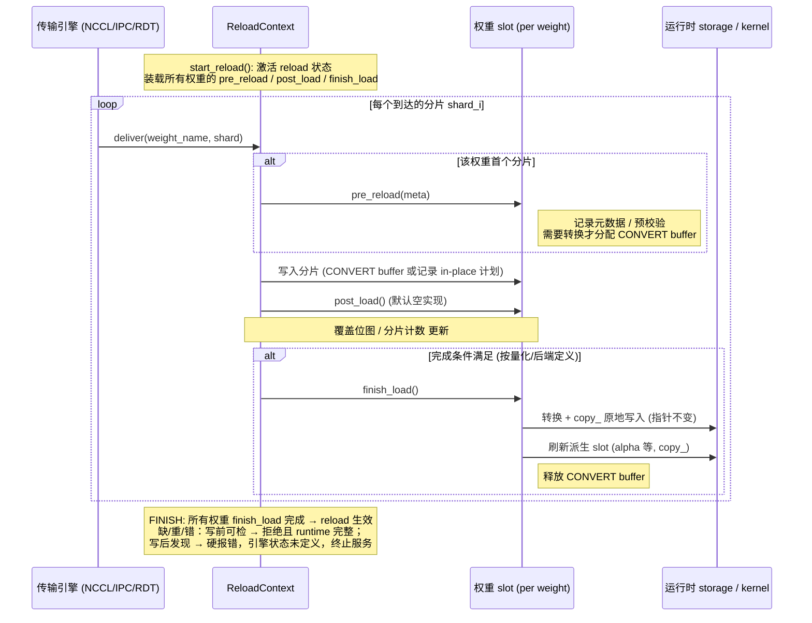
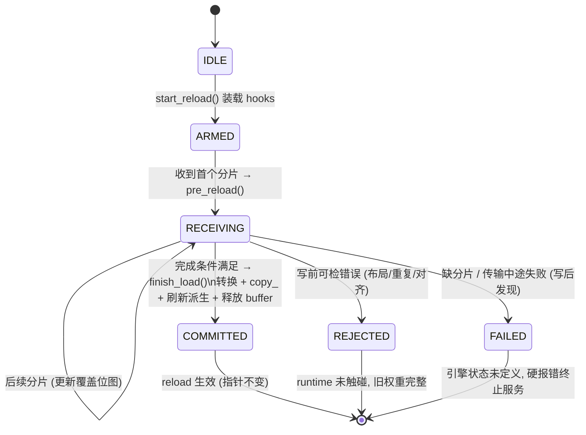

# Weight Reload 抽象设计

状态：设计提案（仅文档，不含代码改动）。

适用范围：`vllm/model_executor/model_loader/reload/` 下的运行时权重热更新路径，
以及量化方法（FP8 dense / CUTLASS FP8 MoE 等）与 reload 流程的交互面。

## 1. 设计目标（硬约束）

按优先级排序，任何抽象层的取舍都必须服从以下四条：

1. **权重完整加载**：一次 reload 只有在"计划内每一个目标张量都被完整、
   恰好一次地写入"之后才允许生效。任何缺失分片、重复分片、形状/精度不匹配
   都必须在写入运行时存储之前被拒绝，而不是以部分写入的状态暴露给推理。
2. **运行时权重指针不偏移（CUDA graph 稳定性）**：reload 后所有被 CUDA
   graph 捕获的权重地址必须逐字节不变。即：
   - 不替换 `Parameter` 对象、不重新分配底层 storage、不新建 kernel 对象；
   - 所有写入都是 `copy_` 到既有 storage；
   - 只有 cold load（首次加载）允许安装 Parameter 与 kernel。
3. **尽量少用暂存 buffer，能原地拷贝就原地拷贝**：当源张量的 layout/dtype
   与运行时存储一致时，直接写进运行时 storage（零暂存）。只有当源需要
   转换（requant、block scale 重排、expert 融合）时才分配转换 buffer，且
   buffer 的生命周期以"一次原子提交"为界，转换完即释放。
4. **不使用 layerwise reload**：不走逐层流式（边下边转边写层）的方案。
   reload 以"一次完整的权重集合"为单位：全部源张量就位并通过完整性校验后，
   一次性提交。layerwise 流式写入在提交中间态上无法保证目标 1，且为省
   显存引入的复杂度与该目标冲突；显存压力通过目标 3 的原地写解决，
   而不是通过把提交拆成逐层。

## 2. 核心抽象

### 2.1 一次 reload 的五个阶段

```
DECLARE -> SOURCE -> VALIDATE -> COMMIT -> FINISH
```

| 阶段 | 职责 | 允许的分配 |
| --- | --- | --- |
| DECLARE | 量化方法/后端声明本次 reload 需要哪些张量（checkpoint 名字、期望 shape/dtype、loader 元数据），并给出运行时落点（runtime slot 到 storage 的映射） | 无（仅元数据） |
| SOURCE | 接收源张量（NCCL/IPC/RDT 等传输引擎喂入），按落点分类：可直接原地写的进入 in-place 队列；需要转换的进入转换队列 | 仅转换 buffer，大小以"单个原子提交单元"为上界 |
| VALIDATE | 完整性校验：计划集合全覆盖、无重复写、无越界写（expert/row/column 覆盖位图）、dtype/shape 匹配 | 无 |
| COMMIT | 一次性把校验通过的数据写入运行时 storage：in-place 队列直接 `copy_`，转换队列转换后立即 `copy_` 并释放 buffer | 转换期间的临时 buffer |
| FINISH | 刷新派生量（alpha、reciprocal scale 等 kernel/config 持有的引用），本次 reload 生效 | 无 |

关键性质：

- **写前可检的错误**（元数据/shape/dtype/偏移/对齐/重复到达）在任何写入
  之前拒绝，此时 runtime 未被触碰，旧权重完整；
- **写后才能判定的错误**（缺分片只能在 FINISH 判定、传输中途失败）发生时，
  原地写已经把部分新值写进了 runtime storage，而我们不保存旧权重——
  此时**引擎状态未定义**：必须硬报错并终止服务（重启或重新 cold load），
  不允许带病继续推理；
- 没有 staged 数据的 FINISH 是 no-op，保证重复触发安全。

### 2.2 Runtime Slot：指针稳定性的载体

每个可被 reload 的运行时张量由一个 **runtime slot** 表示：

- slot 持有 reload 开始时就存在的 storage（cold load 时创建）；
- COMMIT 只对该 storage 做 `copy_`，slot 的 data_ptr、Parameter 对象、
  kernel 内的引用在任意次 reload 后保持不变；
- CUDA graph 捕获的是 slot 的地址，因此 graph 无需重建、无需重新捕获。

这条不变量需要量化方法侧配合：kernel 持有的所有派生张量（如 per-tensor
alpha、activation scale reciprocal）也必须是 slot，由 FINISH 用 `copy_`
刷新，而不是重新赋值属性。

### 2.3 Storage Policy：原地写优先

对每个计划内张量，DECLARE 阶段决定其存储策略（现有
`ReloadStorageMode` 的语义扩展）：

- **IN_PLACE（原地拷贝）**：源 layout/dtype 与运行时一致（例如 dense
  per-tensor FP8 权重、无需重排的 scale）。源到达即 `copy_` 进 runtime
  storage，零额外显存。
- **CONVERT（一次性转换 buffer）**：源需要转换（requant、block scale
  行列交换、gate/up 交换与 padding、expert 融合）。分配与运行时同构的
  转换 buffer，校验后在 COMMIT 内完成转换并写回。

选择规则：能 IN_PLACE 的一律 IN_PLACE；CONVERT buffer 按张量逐个分配、
写回后立即释放，峰值显存 = max(单个张量转换 buffer)，而不是整个模型的
staging 副本。

### 2.4 完整性校验（不写不完整权重）

校验分两类，拒绝语义不同：

1. **写前校验（拒绝后 runtime 完整）**：源 shape/dtype 与 cold load 时
   记录的元数据一致；目标区间越界、block 对齐不满足、别名冲突、同一
   槽位重复到达——都在写入前拒绝。
2. **完成性校验（拒绝时引擎状态未定义）**：DECLARE 声明的每个张量、
   每个分片（expert id、行/列区间、shard_id）恰好写入一次，由覆盖
   位图/到达表在 FINISH 时判定。缺失只能在写流结束后发现，此时原地
   写已发生、无旧权重备份，因此缺失/中途失败一律硬报错，引擎必须
   停止服务（重启或 cold load 恢复），不做静默降级。

不提供部分提交，也不提供跨张量事务回滚：写前校验消除可预防的错误，
写后失败靠硬报错保证错误不扩散到推理输出。GPU 拷贝故障属于进程级
异常，不在本抽象的事务语义内。

## 3. 与现有实现的对应关系

- `ReloadStorageMode.STAGING / ALIAS_RUNTIME` 演化为 CONVERT / IN_PLACE
  语义；`StaticReloadStoragePolicy` 的 allow-list 思路保留，但判定依据从
  "名字白名单"变为"源与运行时 layout 是否一致"。
- CUTLASS FP8 MoE 的 DECLARE/转换/FINISH 三段式（`_prepare_moe_runtime`
  / `_convert_moe_runtime` / `_install_moe_kernel` 与 reload 时的 FINISH
  刷新）是本设计在"需要转换的后端"上的实例：runtime shell 在 cold load
  时建好，reload 只重填内容。
- FP8 dense per-tensor reload 是 IN_PLACE 路径的实例。
- `LayerReloadingInfo` 中 layerwise 的 load_numel/loaded_weights 缓冲机制
  不再作为 reload 主路径；完整性校验改由 DECLARE 计划集合 + 覆盖记录
  承担，按张量/分片粒度而非层粒度。

## 4. 非目标与明确排除

- **不做 layerwise 流式提交**（目标 4）：不引入"逐层就绪逐层写"的状态机。
- **不在 reload 路径重建 CUDA graph、重建 kernel、重新分配 storage**。
- **不实现跨张量事务回滚**：用前置校验消除部分写入的来源，而不是事后回滚。
- EPLB、FNUZ、其他 MoE 后端维持现状（fallback），不在本抽象首版范围。
- 传输引擎（NCCL/IPC/sharded RDT）的协议不变；本抽象只约束张量到达后的
  落点、校验与提交。

## 5. 验收标准

1. 写前可检错误（形状/重复/对齐/别名）-> 写入前报错，运行时权重与
   报错前逐字节一致；写后才发现的错误（缺分片/传输中途失败）-> 硬报错，
   引擎状态未定义，必须停止服务，测试断言不再接受新请求。
2. 连续 N 次 reload 后：所有 runtime slot 的 `data_ptr`、Parameter 对象
   id、kernel 内派生张量指针与首次 cold load 后完全一致；CUDA graph
   可直接 replay，输出与等价 cold load 逐 bit 相同。
3. reload 峰值显存增量 <= max(单个 CONVERT 张量 buffer)；全 IN_PLACE
   的模型 reload 显存增量为 0。
4. 空 reload（无新数据）调用 FINISH 是无副作用 no-op。

## 6. Hook 模型：每个权重绑定 pre_reload / post_load / finish_load

### 6.1 概念

- 每个可被 reload 的权重（runtime slot）绑定两个 hook：
  - `pre_reload`：该权重的**第一个分片到达时**调用一次。职责由量化方法/
    后端自定义：记录 cold-load 元数据、分配 CONVERT buffer（仅当需要
    转换时）、做落点与布局的预校验。
  - `post_load`：**每个分片写入后**调用一次，默认空实现。逐分片的写入与
    登记已经在 load_weight 中完成，此钩子仅为量化后端预留增量处理扩展点；
    当前设计把所有修正推迟到完成时，不为省延迟做逐分片转换。
  - `finish_load`：**满足完成条件后**调用一次。完成条件按量化方式与
    后端不同而不同（dense per-tensor：全部分片到齐；CUTLASS block-wise
    MoE：全部 expert/row/column 覆盖位图填满）。职责：执行转换并把结果
    `copy_` 进 runtime storage、scale clamp / backend repack、刷新派生
    slot（alpha、reciprocal scale）、释放 CONVERT buffer、完成性校验。
    凡是依赖"权重完整"的操作一律放这里，不允许放进 post_load 逐分片执行。
- `start_reload` 在任何分片到达之前调用：进入 reload 状态，遍历计划
  集合把每个权重的两个 hook 装载到 reload 上下文；此时尚未有任何
  数据写入运行时 storage。
- IN_PLACE 权重的 `pre_reload` 只做校验（零分配），`finish_load` 退化为
  直接 `copy_`——"原地拷贝优先"通过 hook 实现自然落地。

### 6.2 时序图



### 6.3 单权重状态机



### 6.4 不同后端的完成条件与 hook 行为

| 后端 | 完成条件 (触发 finish_load) | pre_reload | finish_load |
| --- | --- | --- | --- |
| FP8 dense per-tensor | 该张量全部分片到齐 | 仅校验 shape/dtype，零分配 | 直接 `copy_` 进 runtime storage (IN_PLACE) |
| CUTLASS FP8 MoE (per-tensor scale) | 全部本地 expert 的 w13/w2 + scale 覆盖位图填满 | 校验 expert 元数据，分配 CONVERT buffer | requant + gate/up 交换 + padding 后 `copy_`，刷新 alpha/reciprocal |
| CUTLASS FP8 MoE (block-wise scale) | 权重 + scale_inv 的 expert/row/column 位图填满 | 同上 | block 行列交换 + clamp 后 `copy_`，刷新派生 slot |

渲染图：[reload-seq.png](reload-seq.png)（时序图）、[reload-state.png](reload-state.png)（状态机）。

## 7. 非量化权重的 hook 设计

非量化 = 运行时 storage 与 checkpoint 同 dtype、同 layout（或仅相差融合/切分
结构），因此**所有非量化权重都不需要 CONVERT buffer，全部原地写**。
差异只在"到达追踪的粒度"和"写入偏移的计算"。dtype 不一致的 cast（如 fp32 → bf16）不视为转换：`copy_` 本身隐式完成，零分配。

### 7.1 情况分类

| # | 情况 | 例子 | pre_reload | load_weight | finish_load | 完成条件 |
| --- | --- | --- | --- | --- | --- | --- |
| 1 | 普通密集权重，无融合无切分 | RMSNorm weight、o_proj(单分片到达) | 空实现 | `runtime.copy_(shard)` | 空实现 | 单分片到达即完成 |
| 2 | 行/列融合权重（多逻辑分片写一个张量） | merged QKV（q/k/v 三个 shard_id）、dense MLP gate_up（gate/up 两个 shard_id） | 记录各逻辑分片的行偏移与期望形状 | 按 shard_id 算行偏移，写入对应行区间，登记该 shard_id 已到达 | 空实现（可选：校验） | 全部 shard_id 到齐 |
| 3 | 词表并行 + padding | embedding、lm_head | 记录 padded 行数与真实 vocab 行数 | 只写前 `vocab_size/tp` 行，padding 区保持不动 | 空实现 | 单分片到达 |
| 4 | 共享存储（tied weights） | tie_word_embeddings 的 embedding/lm_head | 登记别名：两个名字指向同一 storage | 同 #3 | 去重：第二个名字到达时识别为同一 slot，不重复写、不重复计数 | 去重后的唯一 slot 写满 |
| 5 | 非量化 MoE 融合专家权重 w2 | `experts.w2_weight` (E×K×N) | 建立 expert 到达表（E 个槽位），记录每个 expert 的行偏移 `e*K` | 按分片携带的 expert_id 写到 `[e*K:(e+1)*K]` 行区间，登记该 expert | 校验 E 个 expert 全部到达 | E 个 expert 全部到齐 |
| 6 | 非量化 MoE 融合专家权重 w13 | `experts.w13_weight` (E×2N×K) | 建立 (expert, half) 二维到达表（E×2 槽位：w1/gate 半区 + w3/up 半区），记录半区行偏移 `e*2N` 与 `e*2N+N` | w1 分片写 `[e*2N : e*2N+N]`，w3 分片写 `[e*2N+N : e*2N+2N]`，分别登记 | 校验 E×2 个槽位全部到达 | E 个 expert 的 w1、w3 全部到齐 |
| 7 | MoE 共享专家 / 稠密旁路 | DeepSeek 式 shared_experts（本质是 dense gate_up + down） | 按 #2 / #1 处理 | 按 #2 / #1 | 按 #2 / #1 | 按 #2 / #1 |
| 8 | dtype 不一致的非量化（cast） | checkpoint fp32 → 运行时 bf16 | 空实现 | `runtime.copy_(shard)`（`copy_` 隐式 cast，零分配） | 空实现 | 分片到齐 |

### 7.2 关键设计点

**到达追踪（ArrivalTracker）。** pre_reload 按权重结构建立到达表：

- 普通权重：1 个槽位；
- 融合 dense 权重：按 shard_id 建槽（q/k/v 或 gate/up）；
- MoE w2：按 expert_id 建 E 个槽位；
- MoE w13：按 (expert_id, half) 建 E×2 个槽位，w1/w3 分片独立登记——
  这正面回答了"w13 需要同时记录 w1 和 w3 到达情况"的需求；
- 每个槽位记录：期望形状、运行时偏移（行区间或 expert 区间）、是否已写。

finish_load 的完成条件统一为"到达表填满"，不同情况只是表的形状不同。
重复到达同一槽位、未知 expert_id、偏移越界都在写入前拒绝。

**偏移计算规则。** 融合权重统一用"逻辑分片 → 运行时行区间"映射：

- w13：`w1_e → [2N·e, 2N·e+N)`，`w3_e → [2N·e+N, 2N·e+2N)`；
- w2：`e → [K·e, K·e+K)`（对 E×K×N 沿第 0 维）；
- merged QKV：按 cold load 时 weight_loader 记录的 q/k/v 行边界；
- gate_up：gate 在前半、up 在后半（与 cold load 的融合顺序一致，不重新发明）。

**中间态可见性（必须明确的假设）。** 非量化权重原地写意味着：全部槽位
填满之前，运行时 storage 处于新旧混合状态。这只有在 **reload 期间推理
静默（START 到 FINISH 之间无 batch 执行）** 的前提下才安全——这也是
完整性语义对非量化路径的实际形态：物理上逐分片写，逻辑上 FINISH 才生效；
FINISH 判出缺失时不存在旧权重可回退，引擎状态未定义，只能硬报错。若未来要求 reload 与推理并发，非量化路径需要退回
staging + FINISH 时一次性 copy_，本设计在 hook 层不排除该策略，但默认
不启用（目标 3：能原地就原地）。

**重复与幂等。** 空到达（无分片）时 finish_load 不触发、FINISH 为 no-op；
同一 reload 内 finish_load 只执行一次，重复 FINISH 安全。

## 8. 离线量化 FP8 per-block 的 hook 设计

量化先按两个维度分类：**在线/离线**（源是已量化权重还是高精度权重），
**per-tensor / per-block / per-channel**（per-channel 视为 per-block 在
某一维上 block=1 的特例）。本节只覆盖**离线 FP8 per-block**：源张量本身
就是 FP8 + block scale，dtype 与运行时一致，差异只在后端 layout。

两条设计修正贯穿全表：其一，默认**写入时映射**（pre_reload 只恢复
layout 映射，load 按映射 copy_ 到 runtime 偏移），物理逆变换降级为
非视图 layout 的后备；其二，clamp 等逐元素修正不进 load，推迟到
finish_load 对整张小 scale 张量一次完成。

### 8.1 hook 分工总表

| # | 情况 | 例子 | pre_reload | load_weight | finish_load | 完成条件 |
| --- | --- | --- | --- | --- | --- | --- |
| 1 | 非 MoE 权重本体 | 任意线性层 FP8 weight | 恢复 layout 映射（通常恒等），校验分片元数据 | 按映射 `copy_` 到 runtime 偏移，登记到达 | 空实现 | 权重分片到齐 |
| 2 | 非 MoE block scale | weight_scale_inv | 恢复 block 行列交换映射 + padding 边界，校验分片元数据 | 按映射 `copy_`（行列交换作用于此），padding 区裁剪，登记到达 | refresh_derived_state：scale clamp、backend repack（若有）、派生 slot 刷新 | scale 分片到齐 |
| 3 | MoE 融合权重 w13 | `experts.w13_weight` (E×2N×K) | 建 E×2 到达表（expert × w1/w3 半区），记录半区行偏移 `2N·e` / `2N·e+N` | 按 (expert_id, half) 写入对应行区间（恒等映射），登记槽位 | 空实现 | E×2 槽位填满 |
| 4 | MoE 融合权重 w2 | `experts.w2_weight` (E×K×N) | 建 E 槽到达表，记录 expert 行偏移 `K·e` | 按 expert_id 写入 `[K·e, K·e+K)`（恒等映射），登记槽位 | 空实现 | E 槽位填满 |
| 5 | MoE w13 block scale | `w13_weight_scale_inv` (E×2⌈N/Bn⌉×⌈K/Bk⌉) | 建 E×2 到达表，恢复 gate/up 半区 + block 行列交换映射 | 按 (expert_id, half) 写入对应半区（行列交换作用于此），登记槽位 | 两半区 scale clamp + 派生 slot 刷新 | E×2 槽位填满 |
| 6 | MoE w2 block scale | `w2_weight_scale_inv` (E×⌈K/Bn⌉×⌈N/Bk⌉) | 建 E 槽到达表，恢复 block 行列交换映射 | 按 expert_id 写入（行列交换作用于此），登记槽位 | scale clamp + 派生 slot 刷新 | E 槽位填满 |
| 7 | 融合 QKV × per-block | merged QKV weight + 各自 scale | 按 shard_id 建槽（q/k/v 各一槽，scale 同）；**校验 q、k 行数是 block 尺寸（128）的倍数**，不满足即拒绝 | 按 shard_id 行区间写入，scale 块随之拼接 | 同 #2 | q/k/v 及各自 scale 全部到齐 |
| 8 | 行并行权重 | o_proj、w2 列切分片 | 校验 block 列块边界与 TP 切分边界对齐，不满足即拒绝 | 按列区间写入，对应列块 scale 写入 | 同 #2 | 列分片到齐 |
| 9 | 非视图 layout（后备路径） | 真正交织/打包的后端格式 | 全部校验前移到逆变换之前，然后物理逆变换 runtime storage | 直接 `copy_`（此时 storage 已是 checkpoint layout） | 正变换回 runtime layout + refresh_derived_state | 分片到齐且正变换完成 |

### 8.2 连带问题（范围外，记录）

| 事项 | 说明 |
| --- | --- |
| per-tensor × 融合 QKV | 融合张量若要求单一 scale，q/k/v 各自 scale 不同须取 max 并 requant——属于转换、需要 CONVERT buffer，不是纯 copy_ 路径。per-block 块间独立，无此问题 |

### 8.3 失败语义

| 路径 | 拒绝点 | 失败后 runtime 状态 | 引擎层要求 |
| --- | --- | --- | --- |
| 写入时映射（默认，#1–#8） | pre_reload 元数据/对齐校验失败：runtime 未被触碰，旧权重完整 | 缺分片/重复/中途失败：到达表不满时已发生部分原地写，无旧权重可回退，引擎状态未定义 | 硬报错并终止服务（重启或 cold load），不允许带病继续推理 |
| 物理逆变换（后备，#9） | 全部校验前移到逆变换之前 | 逆变换一旦发生旧 layout 即不存在，任何后续失败不可恢复 | 逆变换到正变换之间视为原子临界区（推理静默的强形式） |
| 公共语义 | FINISH：到达表填满 → finish_load → 生效 | 空到达 → no-op；缺/重/错一律硬报错 | 不变 |
